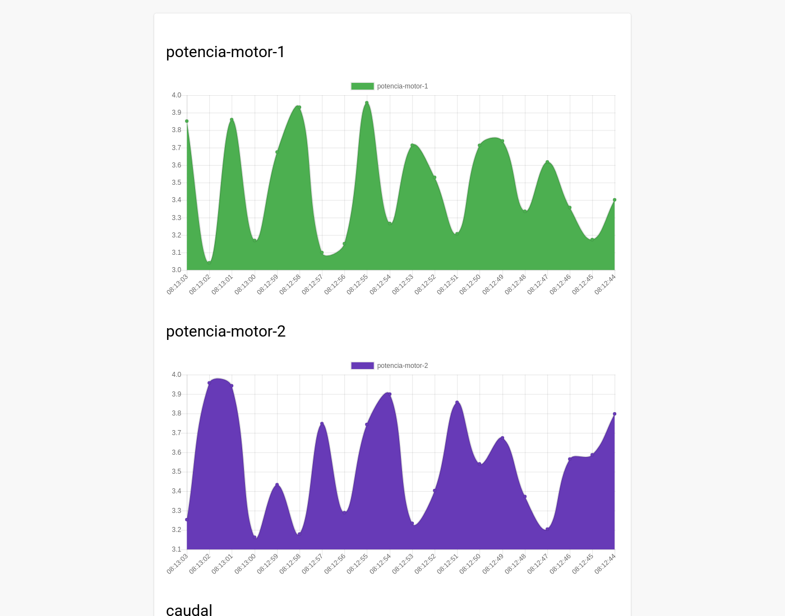

# SmartData Eficiencia Energética

prototipo para el monitoreo y gestion de la eficiencia energética en tiempo real.

## Desarrollos

En éste proyecto se hicieron dos desarrollos para el prototipo:

### Con Node.js

Un sistema completo para IoT basado en el curso de javascipt avanzado de platzi.

### Con Firebase

Implementación de firebase para el manejo de los datos.

**Nota**: Cada desarrollo conlleva un código la lectura y graficación de los datos y un código para la subida de los mismo.

## Screenshot

## Video demostrativo

https://youtu.be/xGPcOxfYT6k